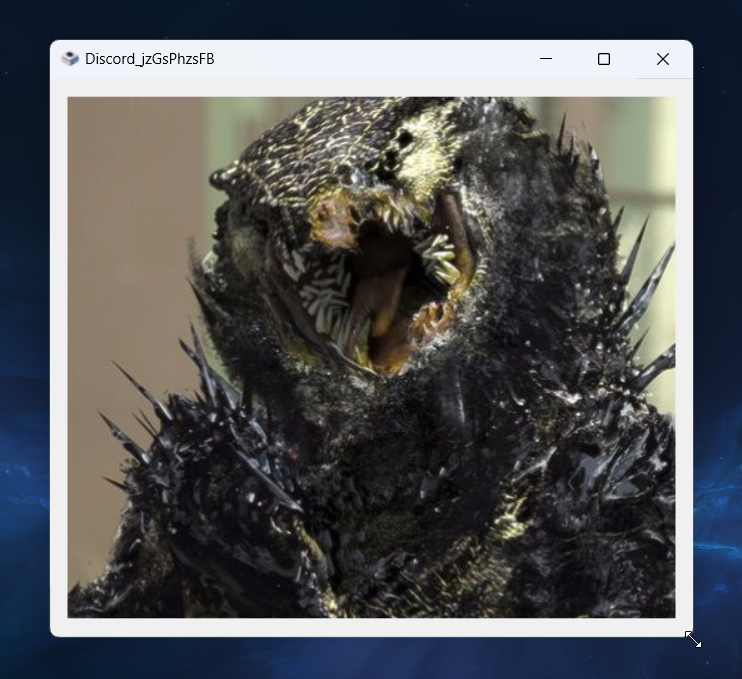

<h1 align=center>Viewport</h1>
<p align=center>A minimal image viewer</p>
<p align=center>
  
</p>

Viewport is an extremely light weight image viewer. Open any image on your computer, or cycle through a folder of images, with zero bloated features. Use `WASD` keybindings to quickly navigate the files without leaving your keyboard. Useful for game development when looking through references, art, screenshots, etc. Fast & stays out the way.

[Download for Windows](https://github.com/telekrex/viewport/releases), or build from source.

Supported image formats: `jpeg, jpg, png, bmp, tif, webp`

Transparency works.

Keybindings, chosen for intuitive speed and because they are agnostic of all operating systems:
```
Previous: Left, or A
Next: Right, or D
First image: J
Last image: K
Shuffle: S
Refresh: R
Open file explorer: E
Exit: Escape
```

See [CONTRIBUTING.md](CONTRIBUTING.md) for notes on contributions.

### Building from source
Install Python dependencies from `Source/.packages`  
Viewport uses `tk` which is included in most Python installations  
`PyInstaller` was used to compile for Windows. This also works on Mac and Linux  
Create a shell script (or enter manually) the equivelent of `build-windows.cmd`  
Resulting binary and files will be in a newly created `Source/dist` folder

---

[See games made by Protoria Studios](https://store.steampowered.com/search/?developer=Protoria%20Studios)

